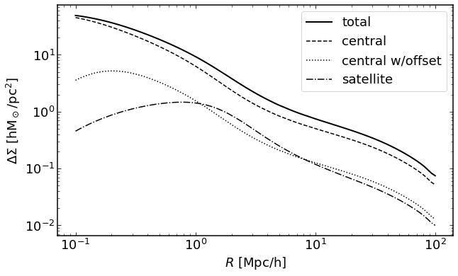
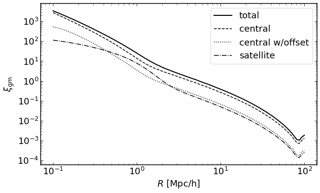
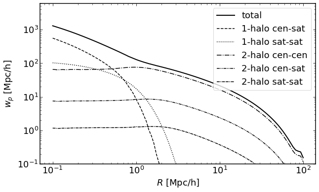
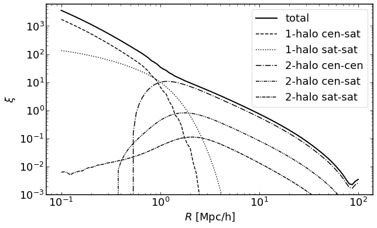

``model_hod`` module tutorial notebook
======================================

.. code:: ipython3

    %load_ext autoreload
    %autoreload 2
    %pylab inline
    import logging
    mpl_logger = logging.getLogger('matplotlib')
    mpl_logger.setLevel(logging.WARNING)
    pil_logger = logging.getLogger('PIL')

.. parsed-literal::

    Populating the interactive namespace from numpy and matplotlib

.. code:: ipython3

    plt.rcParams['font.family'] = 'sans-serif'
    plt.rcParams['font.size'] = 18
    plt.rcParams['axes.linewidth'] = 1.5
    plt.rcParams['xtick.major.size'] = 5
    plt.rcParams['ytick.major.size'] = 5
    plt.rcParams['xtick.minor.size'] = 3
    plt.rcParams['ytick.minor.size'] = 3
    plt.rcParams['xtick.top'] = True
    plt.rcParams['ytick.right'] = True
    plt.rcParams['xtick.minor.visible'] = True
    plt.rcParams['ytick.minor.visible'] = True
    plt.rcParams['xtick.direction'] = 'in'
    plt.rcParams['ytick.direction'] = 'in'
    plt.rcParams['figure.figsize'] = (10,6)

.. code:: ipython3

    from dark_emulator import model_hod

.. code:: ipython3

    hod = model_hod.darkemu_x_hod({"fft_num":8})

.. parsed-literal::

    initialize cosmo_class
    initialize xinl emulator
    Initialize pklin emulator
    initialize propagator emulator
    Initialize sigma_d emulator
    initialize cross-correlation emulator
    initialize auto-correlation emulator
    Initialize sigmaM emulator

how to set cosmology and galaxy parameters (HOD, off-centering, satellite distribution, and incompleteness)
-----------------------------------------------------------------------------------------------------------

.. code:: ipython3

    cparam = np.array([0.02225,0.1198,0.6844,3.094,0.9645,-1.])
    hod.set_cosmology(cparam)

    gparam = {"logMmin":13.13, "sigma_sq":0.22, "logM1": 14.21, "alpha": 1.13, "kappa": 1.25, # HOD parameters
               "poff": 0.2, "Roff": 0.1, # off-centering parameters p_off is the fraction of off-centered galaxies. Roff is the typical off-centered scale with respect to R200m.
               "sat_dist_type": "emulator", # satellite distribution. Chosse emulator of NFW. In the case of NFW, the c-M relation by Diemer & Kravtsov (2015) is assumed.
               "alpha_inc": 0.44, "logM_inc": 13.57} # incompleteness parameters. For details, see More et al. (2015)
    hod.set_galaxy(gparam)

.. parsed-literal::

    INFO:root:Got same cosmology. Keep quantities already computed.

how to plot g-g lensing signal in DeltaSigma(R)
-----------------------------------------------

.. code:: ipython3

    redshift = 0.55
    r = np.logspace(-1,2,100)

    plt.figure(figsize=(10,6))

    plt.loglog(r, hod.get_ds(r, redshift), linewidth = 2, color = "k", label = "total")
    plt.loglog(r, hod.get_ds_cen(r, redshift), "--", color = "k", label = "central")
    plt.loglog(r, hod.get_ds_cen_off(r, redshift), ":", color = "k", label = "central w/offset")
    plt.loglog(r, hod.get_ds_sat(r, redshift), "-.", color = "k", label = "satellite")

    plt.xlabel(r"$R$ [Mpc/h]")
    plt.ylabel(r"$\Delta\Sigma$ [hM$_\odot$/pc$^2$]")
    plt.legend()

.. parsed-literal::

    <matplotlib.legend.Legend at 0x7f8d07656b70>

how to plot g-g lensing signal in xi
------------------------------------

.. code:: ipython3

    redshift = 0.55
    r = np.logspace(-1,2,100)

    plt.figure(figsize=(10,6))

    plt.loglog(r, hod.get_xi_gm(r, redshift), linewidth = 2, color = "k", label = "total")
    plt.loglog(r, hod.get_xi_gm_cen(r, redshift), "--", color = "k", label = "central")
    plt.loglog(r, hod.get_xi_gm_cen_off(r, redshift), ":", color = "k", label = "central w/offset")
    plt.loglog(r, hod.get_xi_gm_sat(r, redshift), "-.", color = "k", label = "satellite")

    plt.xlabel(r"$R$ [Mpc/h]")
    plt.ylabel(r"$\xi_{\rm gm}$")
    plt.legend()

.. parsed-literal::

    <matplotlib.legend.Legend at 0x7f8d095bac50>

how to plot g-g clustering signal in wp
---------------------------------------

.. code:: ipython3

    redshift = 0.55
    rs = np.logspace(-1,2,100)

    plt.figure(figsize=(10,6))

    plt.loglog(r, hod.get_wp(r, redshift), linewidth = 2, color = "k", label = "total")
    plt.loglog(r, hod.get_wp_1hcs(r, redshift), "--", color = "k", label = "1-halo cen-sat")
    plt.loglog(r, hod.get_wp_1hss(r, redshift), ":", color = "k", label = "1-halo sat-sat")
    plt.loglog(r, hod.get_wp_2hcc(r, redshift), "-.", color = "k", label = "2-halo cen-cen")
    plt.loglog(r, hod.get_wp_2hcs(r, redshift), dashes=[4,1,1,1,1,1], color = "k", label = "2-halo cen-sat")
    plt.loglog(r, hod.get_wp_2hss(r, redshift), dashes=[4,1,1,1,4,1], color = "k", label = "2-halo sat-sat")

    plt.xlabel(r"$R$ [Mpc/h]")
    plt.ylabel(r"$w_p$ [Mpc/h]")
    plt.legend()
    plt.ylim(0.1, 6e3)

.. parsed-literal::

    (0.1, 6000.0)

how to plot g-g clustering signal in xi
---------------------------------------

.. code:: ipython3

    redshift = 0.55
    rs = np.logspace(-1,2,100)

    plt.figure(figsize=(10,6))

    plt.loglog(r, hod.get_xi_gg(r, redshift), linewidth = 2, color = "k", label = "total")
    plt.loglog(r, hod.get_xi_gg_1hcs(r, redshift), "--", color = "k", label = "1-halo cen-sat")
    plt.loglog(r, hod.get_xi_gg_1hss(r, redshift), ":", color = "k", label = "1-halo sat-sat")
    plt.loglog(r, hod.get_xi_gg_2hcc(r, redshift), "-.", color = "k", label = "2-halo cen-cen")
    plt.loglog(r, hod.get_xi_gg_2hcs(r, redshift), dashes=[4,1,1,1,1,1], color = "k", label = "2-halo cen-sat")
    plt.loglog(r, hod.get_xi_gg_2hss(r, redshift), dashes=[4,1,1,1,4,1], color = "k", label = "2-halo sat-sat")

    plt.xlabel(r"$R$ [Mpc/h]")
    plt.ylabel(r"$\xi$")
    plt.legend()
    plt.ylim(1e-3, 6e3)

.. parsed-literal::

    (0.001, 6000.0)

