``darkemu`` module tutorial notebook
====================================

.. code:: ipython3

    %load_ext autoreload
    %autoreload 2
    %pylab inline
    import logging
    mpl_logger = logging.getLogger('matplotlib')
    mpl_logger.setLevel(logging.WARNING)

.. parsed-literal::

    Populating the interactive namespace from numpy and matplotlib

.. code:: ipython3

    plt.rcParams['font.family'] = 'sans-serif'
    plt.rcParams['font.size'] = 18
    plt.rcParams['axes.linewidth'] = 1.5
    plt.rcParams['xtick.major.size'] = 5
    plt.rcParams['ytick.major.size'] = 5
    plt.rcParams['xtick.minor.size'] = 3
    plt.rcParams['ytick.minor.size'] = 3
    plt.rcParams['xtick.top'] = True
    plt.rcParams['ytick.right'] = True
    plt.rcParams['xtick.minor.visible'] = True
    plt.rcParams['ytick.minor.visible'] = True
    plt.rcParams['xtick.direction'] = 'in'
    plt.rcParams['ytick.direction'] = 'in'
    plt.rcParams['figure.figsize'] = (10,6)

.. code:: ipython3

    from dark_emulator import darkemu

.. code:: ipython3

    emu = darkemu.base_class()

.. parsed-literal::

    initialize cosmo_class
    Initialize pklin emulator
    initialize propagator emulator
    Initialize sigma_d emulator
    initialize cross-correlation emulator
    initialize auto-correlation emulator
    Initialize sigmaM emulator
    initialize xinl emulator

how to set cosmology
--------------------

.. code:: ipython3

    cparam = np.array([0.02225,0.1198,0.6844,3.094,0.9645,-1.])
    emu.set_cosmology(cparam)

how to plot halo-mass cross correlation for mass threshold halo samples
-----------------------------------------------------------------------

.. code:: ipython3

    rs = np.logspace(-2,2.5,200)

    plt.figure(figsize=(10,6))

    z = 0

    for i, Mmin in enumerate(np.logspace(12,15,7)):
        xihm = emu.get_xicross_massthreshold(rs,Mmin,z)
        plt.loglog(rs,xihm,color="C{}".format(i),label='$M_\mathrm{th}=%0.2g$' %Mmin)
        plt.loglog(rs,-xihm,':',color="C{}".format(i))
    plt.legend(fontsize=12)
    plt.ylim(0.00001,1000000)
    plt.xlabel("$x\,[h^{-1}\mathrm{Mpc}]$")
    plt.ylabel("$\\xi_\mathrm{hm}(x)$")

.. parsed-literal::

    Text(0, 0.5, '$\\xi_\\mathrm{hm}(x)$')

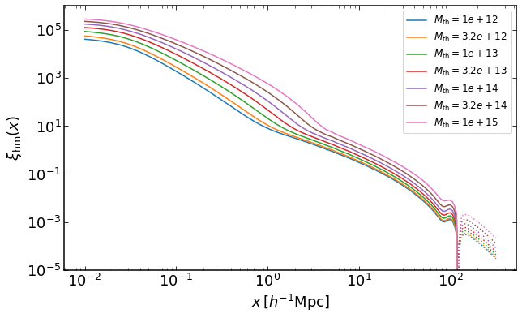

how to plot DeltaSigma(R) for a mass threshold halo samples
-----------------------------------------------------------

.. code:: ipython3

    rs = np.logspace(-1.5,2.5,100)

    plt.figure(figsize=(10,6))

    z = 0

    for i, Mmin in enumerate(np.logspace(12,15,7)):
        dsigma = emu.get_DeltaSigma_massthreshold(rs,Mmin,z)
        plt.loglog(rs,dsigma,label='$M_\mathrm{th}=%0.2g$' %Mmin)
    plt.legend(fontsize=12)
    plt.ylim(0.002,1000)
    plt.xlabel("$r_p\,[h^{-1}\mathrm{Mpc}]$")
    plt.ylabel("$\Delta\Sigma(r_p)\,[h M_\odot \mathrm{pc}^{-2}]$")

.. parsed-literal::

    Text(0, 0.5, '$\\Delta\\Sigma(r_p)\\,[h M_\\odot \\mathrm{pc}^{-2}]$')

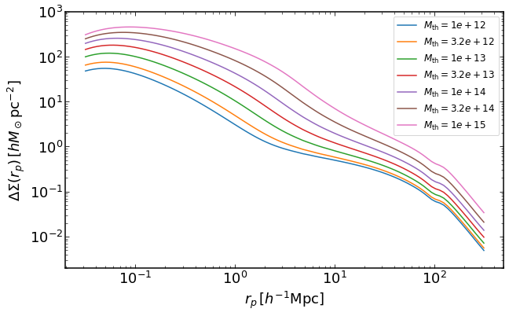

how to plot halo-halo correlation for mass threshold halo samples
-----------------------------------------------------------------

.. code:: ipython3

    rs = np.logspace(-0.5,2.5,400)

    plt.figure(figsize=(10,6))

    z = 0

    for i, Mmin in enumerate(np.logspace(12,14,5)):
        xih = emu.get_xiauto_massthreshold(rs,Mmin,z)
        plt.loglog(rs,xih,color="C{}".format(i),label='$M_\mathrm{th}=%0.2g$' %Mmin)
        plt.loglog(rs,-xih,':',color="C{}".format(i))
    plt.legend(fontsize=12)
    plt.ylim(0.0001,20)
    plt.xlabel("$x\,[h^{-1}\mathrm{Mpc}]$")
    plt.ylabel("$\\xi_\mathrm{hh}(x)$")

.. parsed-literal::

    Text(0, 0.5, '$\\xi_\\mathrm{hh}(x)$')

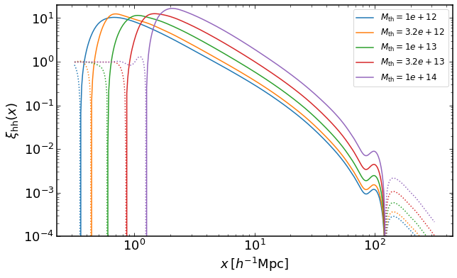

how to plot halo-halo projected correlation function for mass threshold halo samples
------------------------------------------------------------------------------------

.. code:: ipython3

    rs = np.logspace(-0.5,2.5,400)

    z = 0

    plt.figure(figsize=(10,6))

    for i, Mmin in enumerate(np.logspace(12,14,5)):
        wh = emu.get_wauto_massthreshold(rs,Mmin,z)
        plt.loglog(rs,wh,color="C{}".format(i),label='$M_\mathrm{th}=%0.2g$' %Mmin)
        plt.loglog(rs,-wh,':',color="C{}".format(i))
    plt.legend(fontsize=12)
    plt.xlabel("$r_p\,[h^{-1}\mathrm{Mpc}]$")
    plt.ylabel("$w_\mathrm{hh}(r_p)\,[h^{-1}\mathrm{Mpc}]$")

.. parsed-literal::

    Text(0, 0.5, '$w_\\mathrm{hh}(r_p)\\,[h^{-1}\\mathrm{Mpc}]$')

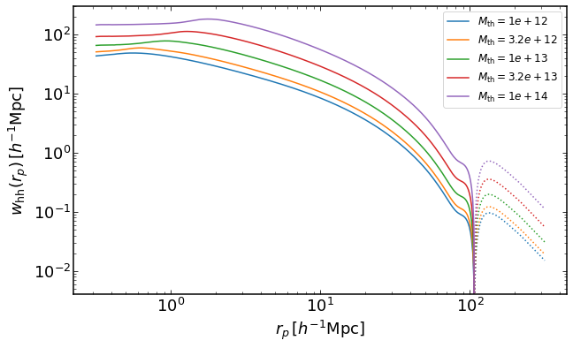

Same as before, but for halos with fixed masses instead of mass threshold samples.
----------------------------------------------------------------------------------

.. code:: ipython3

    rs = np.logspace(-2,2.5,200)
    plt.figure(figsize=(10,6))
    for i, M in enumerate(np.logspace(12,15,7)):
        xihm = emu.get_xicross_mass(rs,M,z)
        plt.loglog(rs,xihm,color="C{}".format(i),label='$M=%0.2g$' %M)
        plt.loglog(rs,-xihm,':',color="C{}".format(i))
    plt.legend(fontsize=12)
    plt.ylim(0.00001,1000000)
    plt.xlabel("$x\,[h^{-1}\mathrm{Mpc}]$")
    plt.ylabel("$\\xi_\mathrm{hm}(x)$")

    rs = np.logspace(-1.5,2.5,100)
    plt.figure(figsize=(10,6))
    for i, M in enumerate(np.logspace(12,15,7)):
        dsigma = emu.get_DeltaSigma_mass(rs,M,z)
        plt.loglog(rs,dsigma,label='$M=%0.2g$' %M)
    plt.legend(fontsize=12)
    plt.ylim(0.002,1000)
    plt.xlabel("$r_p\,[h^{-1}\mathrm{Mpc}]$")
    plt.ylabel("$\Delta\Sigma(r_p)\,[h M_\odot \mathrm{pc}^{-2}]$")

    rs = np.logspace(-0.5,2.5,400)
    plt.figure(figsize=(10,6))
    for i, M in enumerate(np.logspace(12,14,5)):
        xih = emu.get_xiauto_mass(rs,M,M,z)
        plt.loglog(rs,xih,color="C{}".format(i),label='$M=%0.2g$' %M)
        plt.loglog(rs,-xih,':',color="C{}".format(i))
    plt.legend(fontsize=12)
    plt.ylim(0.0001,40)
    plt.xlabel("$x\,[h^{-1}\mathrm{Mpc}]$")
    plt.ylabel("$\\xi_\mathrm{hh}(x)$")

    rs = np.logspace(-0.5,2.5,400)
    plt.figure(figsize=(10,6))
    for i, M in enumerate(np.logspace(12,14,5)):
        wh = emu.get_wauto_mass(rs,M,M,z)
        plt.loglog(rs,wh,color="C{}".format(i),label='$M=%0.2g$' %M)
        plt.loglog(rs,-wh,':',color="C{}".format(i))
    plt.legend(fontsize=12)
    plt.xlabel("$r_p\,[h^{-1}\mathrm{Mpc}]$")
    plt.ylabel("$w_\mathrm{hh}(r_p)\,[h^{-1}\mathrm{Mpc}]$")

.. parsed-literal::

    Text(0, 0.5, '$w_\\mathrm{hh}(r_p)\\,[h^{-1}\\mathrm{Mpc}]$')

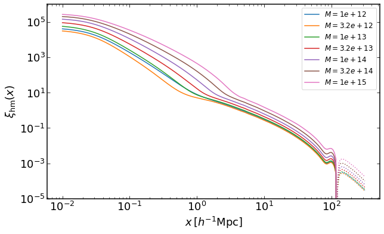

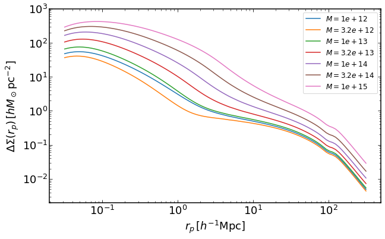

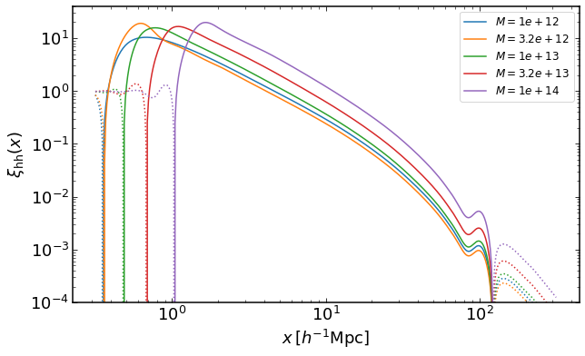

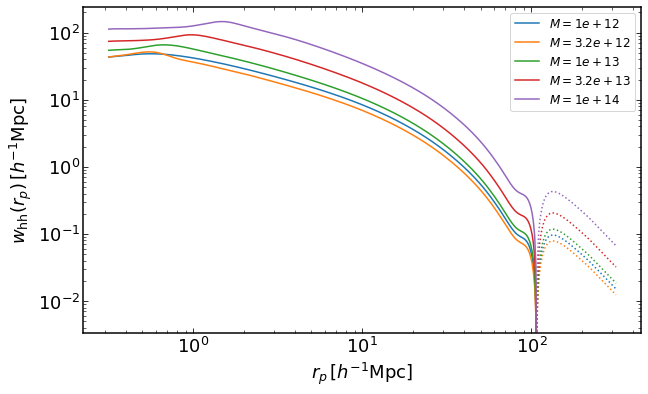

Halo-halo correlation function for halos with 2 different masses
----------------------------------------------------------------

.. code:: ipython3

    rs = np.logspace(-0.5,2.5,400)
    Ms = np.logspace(12,14,3)
    plt.figure(figsize=(10,6))
    ii = 0
    for i in range(3):
        for j in range(i,3):
            xih = emu.get_xiauto_mass(rs,Ms[i],Ms[j],z)
            plt.loglog(rs,xih,color="C{}".format(ii),label='$M_1=%0.2g,\,M_2=%0.2g$' %(Ms[i],Ms[j]))
            plt.loglog(rs,-xih,':',color="C{}".format(ii))
            ii+=1
    plt.legend(fontsize=12)
    plt.ylim(0.0001,40)
    plt.xlabel("$x\,[h^{-1}\mathrm{Mpc}]$")
    plt.ylabel("$\\xi_\mathrm{hh}(x)$")

    rs = np.logspace(-0.5,2.5,400)
    plt.figure(figsize=(10,6))
    ii = 0
    for i in range(3):
        for j in range(i,3):
            wh = emu.get_wauto_mass(rs,Ms[i],Ms[j],z)
            plt.loglog(rs,wh,color="C{}".format(ii),label='$M_1=%0.2g,\,M_2=%0.2g$' %(Ms[i],Ms[j]))
            plt.loglog(rs,-wh,':',color="C{}".format(ii))
            ii+=1
    plt.legend(fontsize=12)
    plt.xlabel("$r_p\,[h^{-1}\mathrm{Mpc}]$")
    plt.ylabel("$w_\mathrm{hh}(r_p)\,[h^{-1}\mathrm{Mpc}]$")

.. parsed-literal::

    Text(0, 0.5, '$w_\\mathrm{hh}(r_p)\\,[h^{-1}\\mathrm{Mpc}]$')

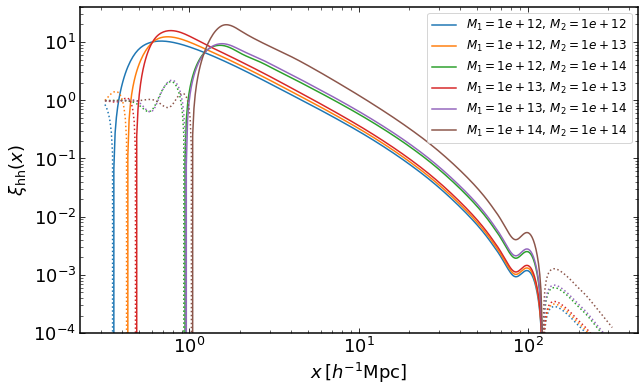

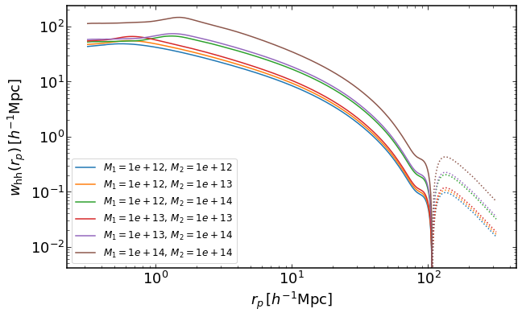

Projected Halo-halo correlation function with finite projection widths
----------------------------------------------------------------------

This takes more time because of an additional direct integration, which
is bypassed by using pyfftlog in other routines.

.. code:: ipython3

    plt.figure(figsize=(10,6))
    ii = 0
    M = 1e13

    for i, pimax in enumerate(np.linspace(50,200,4)):
        wh = emu.get_wauto_mass_cut(rs,M,M,z,pimax)
        plt.loglog(rs,wh,color="C{}".format(i),label='$\Pi_\mathrm{max}=%.1f$' %(pimax))
        plt.loglog(rs,-wh,':',color="C{}".format(i))

    wh = emu.get_wauto_mass(rs,M,M,z)
    plt.loglog(rs,wh,color="C{}".format(4),label='$\Pi_\mathrm{max}=\infty$')
    plt.loglog(rs,-wh,':',color="C{}".format(4))

    plt.legend(fontsize=12)
    plt.xlabel("$r_p\,[h^{-1}\mathrm{Mpc}]$")
    plt.ylabel("$w_\mathrm{hh}(r_p)\,[h^{-1}\mathrm{Mpc}]$")
    plt.ylim(0.01,100)

.. parsed-literal::

    (0.01, 100)

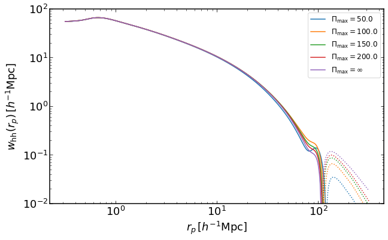

